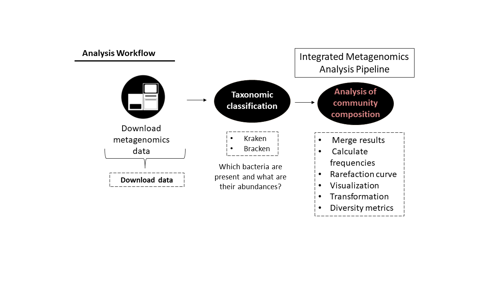

# Integrated Metagenomics Analysis 

This is a tool that integrates all steps required for taxonomic analysis of metagenomic data in an automated manner 

##  Project Introduction

[Metagenomics](https://en.wikipedia.org/wiki/Metagenomics) is a powerful approach for studying the genetic material (DNA) recovered directly from environmental samples. Unlike traditional microbiology, which relies on culturing organisms in the lab, metagenomics allows researchers to analyze the entire community of microorganisms in a given environment. This approach provides insights into the [diversity](https://bio.libretexts.org/Bookshelves/Ecology/Biodiversity_(Bynum)/7%3A_Alpha_Beta_and_Gamma_Diversity) and [composition/taxonomy](https://www.lawinsider.com/dictionary/taxonomic-composition#:~:text=Taxonomic%20composition%20means%20the%20identity,or%20within%20a%20water%20body.) of microbial communities, which are crucial for understanding ecosystems, human health, agriculture, and biotechnology.

However, the process of analyzing taxonomic data involves multiple complex and time-consuming steps and there is currently no standard protocol. The **Integrated Metagenomics Analysis Pipeline** is designed to streamline downstream analysis of taxonomy offering a solution for comprehensive metagenomic analysis from taxonomic classification (see explanation below) to diversity metrics. 

**Input**: taxonomy tables from kraken&braken taxonomy classifier algorithms 

**Note**: there is a section at the end that explains in detail how to get taxonomy tables from metagenomic data. It includes all steps from downloading publicaly available data from SRA  

## Up-stream steps
### (1) Generating Data


To generate metagenomic data:
1. **DNA Extraction**: DNA is isolated from the sample.
2. **DNA Fragmentation**: The DNA is broken into smaller pieces, called reads.
3. **Sequencing**: The reads are sequenced using Next-Generation Sequencing (NGS) techniques, producing a large volume of sequence data that represents the sample's genetic diversity.

**Next-Generation Sequencing (NGS)** technologies enable high-throughput sequencing, allowing millions of DNA fragments to be sequenced simultaneously. This capability is essential for metagenomic studies, which aim to analyze the vast and diverse microbial populations in complex samples.



### (2)  Download Data/Produce Your Own Data
### (3) Taxonomic Classification: What Microorganisms Are Present?
    
    **Integrated Metagenomics Analysis Pipeline**
### (4) Analysis of Taxonomic Results (Python-based)

Once the taxonomic classification is complete, we will perform a comprehensive analysis of the results using Python. This analysis includes:

- **Merge all samples into one matrix**: for all downstream analysis we want to create one table/matrix that contains the taxonomic classification results of all samples in the project. The table dimensions are species x # of samples

View complete matrix output file: [matrix.txt](readCount.txt)

- **Read Counts to Frequencies**: Converting raw read counts into relative frequencies to account for differences in sequencing depth across samples. This normalization allows for more accurate comparisons between samples.
- **Rarefaction Curves**: Generating [rarefaction curves](https://esajournals.onlinelibrary.wiley.com/doi/10.1002/ecs2.4363#:~:text=Rarefaction%20curves%20estimate%20the%20expected,1971%3B%20Sanders%2C%201968).) to assess the adequacy of sequencing depth. These curves help determine if the sampling effort has been sufficient to capture the diversity present in the samples.
- **Data Distribution Visualizations and Transformations**: Visualizing the distribution of taxa across samples using various plots (e.g., bar plots, heatmaps). Transformations (e.g., log transformation) may be applied to stabilize variance and meet the assumptions of statistical tests.
- **Diversity Metrics**: Calculating diversity metrics such as [alpha](https://docs.onecodex.com/en/articles/4136553-alpha-diversity) diversity (within-sample diversity) and [beta](https://www.statisticshowto.com/bray-curtis-dissimilarity/) diversity (between-sample diversity). These metrics provide insights into the complexity and variation of microbial communities.

# Pipeline Summary 
Analysis of taxonomic results:
    - merge results files 
    - Read counts to frequencies 
    - Rarefaction curves 
    - Data distribution visualizations and transformations
    - Diversity metrics

###  Getting ready:
1. install dependencies 

```sh
pip install -r requirements.txt
``` 
2. download code: 
```sh
python taxonomicAnalysis.py
```
3. Run tests with pytest: 
```sh
pytest 
```
**Work in progress**: Soon detailed instruction for each step will be added & appropiate code for each section of the pipeline 


Steps previous to the utilization of these pipeline: 
## For a project of interest this pipeline will:
1. Download accesion list from [SRA Run Selector](https://0-www-ncbi-nlm-nih-gov.brum.beds.ac.uk/Traces/study/) 
2. Download all genomic files of project from [SRA](https://www.ncbi.nlm.nih.gov/sra)
3. Taxonomic classification using [Kraken algorithm](https://ccb.jhu.edu/software/kraken/MANUAL.html)
4. Re-estimate read counts using [Bracken algorithm](https://github.com/jenniferlu717/Bracken) 

###  (1) Download data (optional) 
 **Download Data/Produce Your Own Data**

Once we have the sequences, the goal is to identify the microorganisms present in the community and determine the proportions of each organism within the sample, approximating their abundances in the community. 

### (2) Taxonomic Classification: What Microorganisms Are Present?

To determine the species present the [Kraken algorithm](https://ccb.jhu.edu/software/kraken/MANUAL.html) is a highly accurate and efficient tool for assigning taxonomic labels to metagenomic DNA sequences. 

**Kraken Output**: Kraken generates a detailed report of the taxonomic composition of the sample by counting the number of reads that match each species in a provided database. The main output is a table/matrix for each sample, listing the number of reads corresponding to each identified microorganism.

View a complete kraken output file: [sample.k2report](SRR14291145.k2report)

Using the **sample.k2report output from Kraken**, [Bracken algorithm](https://github.com/jenniferlu717/Bracken), which uses Bayes' theorem to re-estimate the number of reads that match a species. This step is necessary because some reads will match more than one species.

View complete braken output file: [sample.bracken](SRR14291145.bracken)
### Running instructions: 

For examplify the use of this pipeline we will run all the steps for the following project: 

    PRJNA664754

Create a directory to store all files and code 
```sh
mkdir integrated_analysis    
```

#### Step 0: download data 
**OPTIONAL**: This step is optional and not automated- If you have your own data already proceed to step 1

1. Download accesion list from [SRA Run Selector](https://0-www-ncbi-nlm-nih-gov.brum.beds.ac.uk/Traces/study/)

a. Search for accesion list of project: Write project name and click on **search** 

b. Click on "Acession list" to download a txt file containing the names of all the files in the project  
c. Move file into "integrated_analysis" folder and change file-name to "accession_list.txt"

View [accession list](SRR_Acc_List.txt) file

2. Download all fastq files of project 

a. Download [**SRA-toolkit**](https://github.com/ncbi/sra-tools/wiki/02.-Installing-SRA-Toolki)

b. Download files: 
```sh
prefetch --option-file accession_list.txt
```
#### Step 1: taxonomic classification 

0. Create a new folder "fastq" (Inside integrated_analysis folder) and move all fastq files 

```sh
mkdir fastq 
mv *.fastq.gz fastq
```

1. Kraken

**Note**: We can assess the presence of species, genus, families, and other taxonomic levels. For simplicity, we will focus on species.

a. Download kraken to integrated_analysis folder: [link](https://github.com/DerrickWood/kraken2/blob/master/docs/MANUAL.markdown) 

Or use: 
```sh
mkdir kraken
cd kraken 
./install_kraken2.sh 
```

b. Download database & unpack (inside kraken folder): this one has been updated in 2024
```sh
wget https://genome-idx.s3.amazonaws.com/kraken/k2_standard_20240112.tar.gz 

tar -xzvf k2_standard_20240112.tar.gz
```
c. Run kraken on all samples: 

**Note**: Make sure the names of R1 and R2 have the following format: name_1_.fastq.gz and  name_2_.fastq.gz

```sh
./kraken_loop_paired.sh 
```
2. Bracken

a. Install bracken 
 ```sh
 mkdir bracken
 cd bracken 
  ./install_bracken.sh 
 ```
b. Run braken on all samples:

```sh
./bracken_loop.sh

```


> This project was originally implemented as part of the [Python programming course](https://github.com/szabgab/wis-python-course-2024-04)
> at the [Weizmann Institute of Science](https://www.weizmann.ac.il/) taught by [Gabor Szabo](https://szabgab.com/)
